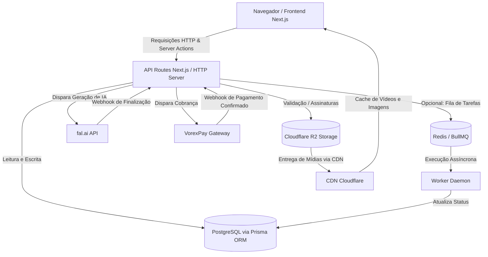

# ARCHITECTURE - VORIXA

Este documento descreve a arquitetura de software, infraestrutura e fluxos de dados adotados na plataforma **VORIXA**, com foco na preparação para escala comercial com infraestrutura inicial enxuta.

## 1. Visão Geral da Arquitetura

A plataforma é desenvolvida sob o modelo de **Monolito Integrado com Workers Separados Conceitualmente**. O frontend e backend rodam no mesmo projeto Next.js (App Router), porém a carga de processamento pesado de jobs e integração assíncrona é isolada para garantir escalabilidade horizontal e não-bloqueio do servidor HTTP.



---

## 2. Padrão de Diretórios (Monorepo)

O projeto segue uma estrutura modular rígida:

```text
/
├── components/          # Componentes visuais reutilizáveis (shadcn/ui, cards, forms)
├── app/                 # Estrutura de rotas do Next.js (App Router)
│   ├── (auth)/          # Rotas de cadastro, login, recuperação de senha
│   ├── (dashboard)/     # Painel do cliente e ferramentas de geração de IA
│   ├── (admin)/         # Painel administrativo protegido por RBAC
│   ├── api/             # API Routes (Endpoints internos e receptores de Webhooks)
│   └── page.tsx         # Landing Page / Página pública de vendas
├── services/            # Camadas de integração (fal.ai, payment provider, storage)
├── hooks/               # Custom hooks do React
├── lib/                 # Inicialização de bibliotecas (prisma, s3Client, utils)
├── docs/                # Documentação técnica e de negócio (arquivos Markdown)
├── documents/           # Controle de tarefas do projeto
├── prisma/              # Schema do Prisma ORM e arquivos de migração
└── public/              # Ativos públicos (imagens, fontes, favicons)
```

---

## 3. Escalabilidade Horizontal e Statelessness

Para permitir que a aplicação execute com múltiplas instâncias atrás de um balanceador de carga em momentos de pico de tráfego, todos os componentes devem ser estritamente **stateless** (sem estado local):
* **Sessões**: Gerenciadas via JWT criptografados auto-suficientes, sem persistência em memória local da instância ou filesystem local.
* **Uploads**: Armazenados diretamente em Cloudflare R2 utilizando caminhos dinâmicos. Arquivos temporários nunca são retidos no filesystem local dos containers de produção.
* **Cache**: Se necessário compartilhar estados rápidos entre instâncias (como rate limiting distribuído ou locks temporários de jobs), um banco Redis centralizado será introduzido (Fase de Crescimento).

---

## 4. Fluxo de Geração Assíncrona de IA (Jobs)

A geração de IA consome tempo de execução. O fluxo assíncrono é desenhado para permitir migração para um sistema de filas dedicado (como Redis + BullMQ) no futuro sem alterar a lógica de negócios central:

1. **Cliente** envia dados de geração (prompt, imagem de referência, etc.) para `/api/jobs/create`.
2. O **Backend (HTTP Server)**:
   * Verifica o saldo de créditos do usuário com bloqueio concorrente via `prisma.$transaction`.
   * Cria o registro `AIJob` com status `PENDING` e debita os créditos.
   * Dispara a requisição para a **fal.ai** informando o webhook `/api/webhooks/fal`.
   * Atualiza o `AIJob` com o `providerJobId` da fal.ai e altera o status para `PROCESSING`.
3. O **Backend** retorna imediatamente o `jobId` interno (HTTP 202).
4. O **Webhook do VORIXA** recebe a conclusão da fal.ai:
   * Valida a assinatura de segurança do payload.
   * Se sucesso: Transfere o arquivo da fal.ai para o Cloudflare R2, registra o `File`, associa ao `AIJobOutput` e altera status do job para `COMPLETED`.
   * Se falha: Altera status do job para `FAILED` e inicia o **estorno automático** transacional de créditos.

---

## 5. Distribuição de Mídias (CDN)

A entrega de arquivos de vídeo e imagem não deve sobrecarregar o servidor Next.js. Toda mídia gerada ou carregada pelo usuário no Cloudflare R2 é distribuída aos clientes por meio de uma **CDN (Content Delivery Network)** com regras de cache ativas para arquivos estáticos (`public, max-age=31536000`), minimizando os custos de tráfego de saída (*egress fees*).
