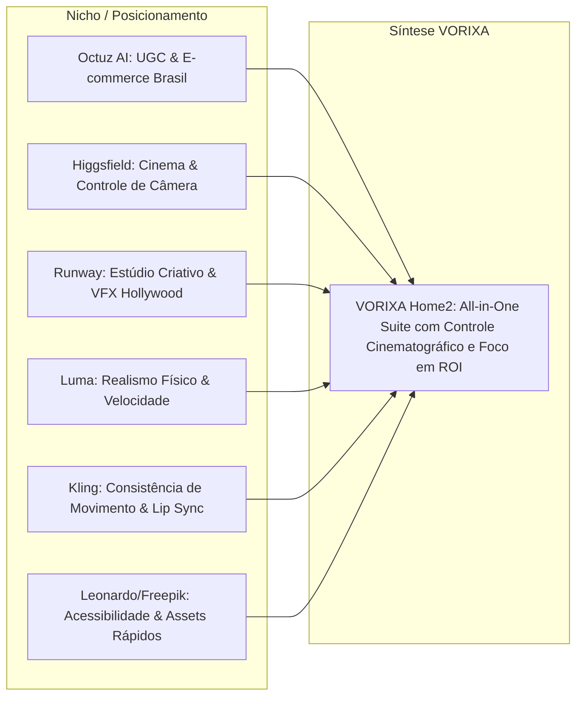
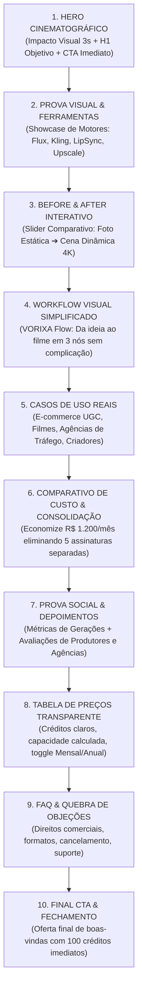

# Relatório de Benchmarking & Engenharia Reversa de UX/UI: Plataformas Líderes de IA Audiovisual
**Documento Técnico & Estratégico para Concepção da Nova Home (Home2) — VORIXA**  
**Data:** 02/09/2026 | **Autor:** @vorixa-benchmark-researcher | **Status:** Aprovado para Implementação

---

## 1. Sumário Executivo & Objetivos da Pesquisa

O mercado de geração de vídeo e imagem com Inteligência Artificial amadureceu: o usuário não se impressiona mais apenas com a promessa de "criar com IA". Hoje, a conversão é ditada por **três pilares fundamentais**:
1. **Controle Determinístico vs. Roleta-Russa:** O criador quer saber se o resultado final será consistente (câmera, iluminação, consistência de personagem e sincronização).
2. **Eficiência de Custo & Consolidação All-in-One:** A dor de pagar 5 a 6 assinaturas separadas (Midjourney, Runway, Kling, ElevenLabs, Upscalers) vs. ter um ecossistema unificado.
3. **Experiência de Produto Instantânea (Show, Don't Tell):** Zero fricção para entender o fluxo de trabalho antes de se cadastrar, retendo a atenção nos primeiros 3 segundos sem efeitos visuais cansativos ou "scroll-jacking".

Este documento disseca a engenharia reversa das plataformas líderes globais e nacionais — **Octuz AI, Higgsfield AI, RunwayML, Luma Dream Machine, Kling AI e Leonardo AI / Freepik** — fornecendo a arquitetura narrativa, os padrões visuais editoriais e as diretrizes práticas para a construção da nova **Home2 do VORIXA**.

---

## 2. Análise Individual das Plataformas de Referência

---

### 2.1 Octuz AI (https://octuz.ai/) — O Benchmark de Conversão para o Mercado Brasileiro e Performance
* **Foco Principal:** Automação de anúncios em vídeo, influenciadores virtuais realistas e UGC (User Generated Content) para e-commerce, afiliados e infoprodutores.
* **Proposta de Valor Principal:** *"Crie vídeos virais de vendas sem precisar gravar ou contratar influenciadores caros."*
* **Pontos Fortes de Conversão:**
  - **Linguagem orientada a Lucro/Tempo:** Aborda diretamente a dor do criador de conteúdo e agência (tempo de gravação, custo de influenciadores, testes de criativos de alta escala).
  - **Comparativo Financeiro Direto:** Mostra quanto custa produzir 1 vídeo tradicional (R$ 500 a R$ 2.000) vs. criar dezenas de variações no software em minutos.
  - **Exemplos Nacionais Reais:** Vídeos verticais 9:16 nativos para Reels/TikTok, quebrando a barreira de "vídeo conceitual sem aplicação prática".
* **Gargalos Identificados:**
  - Interface às vezes sobrecarregada com muitos popups ou escassez artificial agressiva.
* **Lições para o VORIXA:** Incorporar uma seção dedicada a **Criativos de Alta Conversão / UGC** e **Influenciadores Digitais**, demonstrando o potencial de monetização e geração de receita rápida para agências e marcas locais.

---

### 2.2 Higgsfield AI (https://higgsfield.ai/) — O Benchmark de Controle de Câmera & Direção de Cinema
* **Foco Principal:** Geração cinematográfica com controle total de câmera (pans, tilts, zooms, orbits, focal length, aperture/depth of field).
* **Proposta de Valor Principal:** *"Director's Control: pare de adivinhar prompts e assuma o controle da câmera física."*
* **Pontos Fortes de Conversão:**
  - **Hero Minimalista e Cirúrgico:** Vídeo em altíssima resolução com micro-controles interativos simulando um visor de câmera profissional (f/1.8, 50mm, Tracking Shot).
  - **Interatividade Tátil:** Permite que o visitante clique em diferentes movimentos de câmera (ex: "FPV Drone", "Crane Down", "Whip Pan") e veja instantaneamente o mesmo frame reagir àquele comando.
  - **Estética Dark Editorial:** Tons grafite profundos (`#0A0A0C`), tipografia sans-serif precisa e acentos em tons frios que comunicam robustez profissional e cinema.
* **Lições para o VORIXA:** Destacar o recurso **Motion Control / Câmera 3D** do VORIXA com um componente interativo de "Seletor de Movimento de Câmera", transmitindo autoridade cinematográfica e precisão milimétrica.

---

### 2.3 RunwayML (https://runwayml.com/) — O Benchmark de Ecossistema Criativo e Storytelling
* **Foco Principal:** Suíte completa de geração multimodal (Gen-3 Alpha, Act-One, Motion Brush, Audio-to-Video).
* **Proposta de Valor Principal:** *"Advancing creativity with artificial intelligence."*
* **Pontos Fortes de Conversão:**
  - **Uso Magistral do Espaço Negativo:** A landing page não é poluída; cada ferramenta possui um bloco expansivo onde o vídeo ocupa 80% do campo de visão, atuando como o verdadeiro herói.
  - **Abas de Casos de Uso Filtráveis:** Filtros por indústria (Publicidade, Entretenimento, Música, Design) com players de vídeo sem som que iniciam com hover suave.
  - **Tipografia Escultural:** Contraste harmonioso entre tipografia técnica (monospace para parâmetros de IA) e serifada/neo-grotesque para manchetes editoriais.
* **Lições para o VORIXA:** Eliminar o excesso de texto explicativo no Hero; utilizar tags técnicas sutis (`4K UHD`, `60 FPS Motion`, `Sync-1.2`) para dar sofisticação e deixar os vídeos demonstrarem o valor.

---

### 2.4 Luma Dream Machine (https://lumalabs.ai/dream-machine) — O Benchmark de Velocidade e Física Hiper-Realista
* **Foco Principal:** Vídeos com fidelidade física impecável, continuidade temporal fluida e renderização ultrarrápida.
* **Proposta de Valor Principal:** *"Build the imagination engine."*
* **Pontos Fortes de Conversão:**
  - **Prompt Sandbox no Hero:** Um campo de input de prompt logo no topo da página que convida o usuário a experimentar imediatamente ou visualizar prompts da comunidade em tempo real.
  - **Carrossel Infinito sem Quebra de Performance:** Grid de vídeos otimizados via streaming H.264 em `video` tags nativas, sem travamentos de GPU ou perda de frames.
* **Lições para o VORIXA:** Oferecer na Home uma barra de visualização de prompts reais ("Prompt Showcase") onde o visitante clica num botão e vê exatamente o prompt que gerou aquele vídeo com 1 clique.

---

### 2.5 Kling AI (https://klingai.org/) — O Benchmark de Movimento Complexo e Expressão Labial
* **Foco Principal:** Vídeos de até 10 segundos com simulação de corpos, expressões humanas e sincronização labial (Lip Sync) precisa.
* **Proposta de Valor Principal:** *"Bring any idea to life with ultra-long cinematic motion."*
* **Pontos Fortes de Conversão:**
  - **Antes e Depois Interativo (Interactive Slider):** Demonstração nítida de uma foto estática transformada em uma performance dinâmica com áudio e lábios sincronizados.
  - **Workflow Passo a Passo Visual:** Divisão simples em 3 etapas: *Upload de Imagem/Texto* ➔ *Configuração de Movimento* ➔ *Exportação em 4K*.
* **Lições para o VORIXA:** O componente de **Before/After** e **Lip Sync Demo** é crucial para validar que o VORIXA não produz apenas animações estáticas, mas personagens falantes e vivos.

---

### 2.6 Leonardo AI / Freepik AI Suite — O Benchmark de Acessibilidade e Tabela de Planos Clara
* **Foco Principal:** Criação veloz de assets para criadores diários, designers e pequenas agências.
* **Pontos Fortes de Conversão:**
  - **Calculadora de Créditos / Capacidade dos Planos:** Tabela de preços que esclarece exatamente quantos vídeos, imagens e upsizes cada plano entrega, acabando com a confusão comum de "quantos créditos eu realmente preciso?".
  - **Badges de Prova Social e Comunidade:** Contadores de usuários ativos ("+5M criadores"), galeria de criadores e reviews auditados.
* **Lições para o VORIXA:** A seção de Preços da Home2 deve incluir o resumo tangível de entregáveis (ex: *"Equivale a ~80 vídeos cinematográficos ou ~400 imagens em 4K"*).

---

## 3. Matriz Comparativa de Recursos e Estrutura de UX

| Dimensão de Análise | Octuz AI | Higgsfield AI | RunwayML | Kling AI | VORIXA Home2 (Estratégia Recomendada) |
| :--- | :--- | :--- | :--- | :--- | :--- |
| **Primeira Dobra (Hero)** | Foco em ROI & UGC | Câmera & Cinema | Minimalista & Arte | Demo de Prompt | **Hero Duplo: Arte Cinematográfica + Lucratividade Comercial** |
| **Tempo de Retenção (3s)** | Vídeo vertical viral | Movimento de câmera | Loop 4K horizontal | Slider interativo | **Loop de alta fidelidade sem rotação estranha + Badges táteis** |
| **Workflow Narrativo** | Foco em escala de ads | Parâmetros de estúdio | Linha do tempo de IA | 1-2-3 Passo a Passo | **Grafo Interativo VORIXA FLOW + 3 Passos Simplificados** |
| **Solução de Custos** | Mostra economia de ads | Não enfatiza preço | Tier corporativo | Baseado em créditos | **Comparativo: 5 Assinaturas Isoladas vs. VORIXA All-in-One** |
| **Quebra de Objeção** | Direitos autorais & Ads | Controle de movimento | Resolução e consistência | Duração e Lip Sync | **Cards de Garantia: Direitos Comerciais, Sem Marca d'Água, 4K nativo** |
| **Estética Visual** | Dark Moderno / Roxo | Dark Graphite Cinema | Dark Clean Minimal | Dark High-Tech | **Dark Obsidian (`#08080A`) com acentos Violeta/Indigo e acabamento Off-White** |

---

## 4. O Segredo dos Primeiros 3 Segundos: Retenção sem Fadiga Visual

Muitas landing pages modernas cometem o erro de aplicar "scroll-jacking" excessivo, efeitos de zoom 3D vertiginosos ou bibliotecas Three.js pesadas que sobrecarregam a CPU/GPU do visitante e aumentam a taxa de rejeição (bounce rate).

### 4.1 O Que Evitar (Anti-Padrões de Mercado)
1. **Zooms 3D Agressivos no Scroll:** Causam desorientação espacial e travam em dispositivos intermediários/móveis.
2. **Textos Gigantes com Animações Lentas de Revelação:** O visitante não quer esperar 2 segundos para ler o título principal.
3. **Carregamento Bloqueante de Vídeos sem Poster:** Vídeos que ficam como telas pretas por 1,5s destroem a primeira impressão.

### 4.2 O Padrão Ouro de Retenção Imediata (Adotado para Home2)
1. **Vídeo Autoplay Silencioso Otimizado:** Uso de `video` nativo com `muted playsInline autoPlay loop preload="auto"`, com dimensões fixas para evitar layout shifts (CLS = 0).
2. **Badge de Impacto Imediato:** Tag de topo com micro-brilho: `✦ Suíte Cinematográfica All-in-One de Criação Audiovisual`.
3. **Tipografia de Duplo Impacto:** Título com fonte Sans-Serif geométrica robusta combinada com itálico editorial sutil para palavras-chave (ex: *"Crie vídeos cinematográficos com **controle absoluto** de movimento"*).
4. **Chamada de Ação Primária com Micro-Interação:** Botão com gradiente vibrante e badge de incentivo imediato (*"Comece Grátis com 100 Créditos — Sem Cartão"*).

---

## 5. Estrutura Narrativa de Alta Conversão (10 Seções Essenciais)

A jornada da Home2 foi estruturada para conduzir o visitante do encantamento visual à certeza racional de contratação:

### Detalhamento das 10 Seções:

1. **Hero Cinematográfico (A Dobra de Impacto):**
   - *Headline:* "Crie Vídeos e Imagens Cinematográficas com Controle Total de Movimento."
   - *Subtítulo:* "Esqueça a roleta-russa de prompts. Direcione câmeras, anime personagens com sincronia labial perfeita e produza anúncios de alta conversão em minutos."
   - *CTAs:* Botão Principal `[Começar a Criar Agora — 100 Créditos Grátis]` + Botão Secundário `[Explorar Workflows]`.
   - *Mídia Central:* Loop de vídeo widescreen 16:9 em moldura de vidro com badges de controle tátil flutuantes (ex: *Câmera: Drone 4K*, *Modelo: Kling 1.5*, *Voz: Sync Studio*).

2. **Vitrine dos Motores de IA (Engines Showcase):**
   - Abas táteis interativas: `FLUX (Imagens Ultra-Realistas)`, `Kling Motion (Vídeos Cinemáticos)`, `Sync Labial (Lip Sync)`, `Motion Control (Transferência de Movimento)`, `4K Upscaler`.
   - Mudança de vídeo em tempo real ao alternar de aba com transição suave de opacidade.

3. **Antes e Depois Interativo (Interactive Proof Slider):**
   - Componente arrastável permitindo que o usuário veja a transformação de uma imagem simples em um vídeo com iluminação de estúdio e movimento fluido.

4. **VORIXA Flow (O Workflow Descomplicado):**
   - Visualização de nós simplificados: `Prompt / Referência` ➔ `Direção de Câmera` ➔ `Geração & Lip Sync` ➔ `Master 4K`.
   - Demonstração de que qualquer pessoa pode criar sem conhecimentos prévios de VFX ou programação.

5. **Casos de Uso Práticos & Aplicação no Mundo Real:**
   - Cards temáticos:
     * *E-commerce & UGC Viral:* Vídeos de produtos que multiplicam o ROAS de campanhas.
     * *Agências & Criadores de Conteúdo:* Produção de 30 dias de conteúdo em 1 tarde.
     * *Produtoras Audiovisuais:* Storyboards, concept arts e cenas prontas para pós-produção.
     * *Influenciadores Virtuais:* Criação de avatares com identidade visual 100% consistente.

6. **Comparador Financeiro (A Matemática da Economia):**
   - Tabela lado a lado mostrando o custo de assinar ferramentas isoladas:
     - Gerador de Imagem: R$ 180/mês
     - Gerador de Vídeo: R$ 350/mês
     - Sincronização Labial: R$ 220/mês
     - Upscaler 4K: R$ 150/mês
     - **Total Isolado:** ~R$ 900 a R$ 1.200/mês.
     - **VORIXA All-in-One:** A partir de R$ 49/mês (Economia superior a 80%).

7. **Prova Social e Comunidade:**
   - Métricas: *+150.000 mídias renderizadas*, *+12.000 criadores e agências*, *99.8% de tempo de resposta em nuvem*.
   - Depoimentos reais de diretores de arte, gestores de tráfego pago e criadores.

8. **Planos & Tabela de Preços (Com Calculadora de Capacidade):**
   - Visualização em 3 Tiers: *Starter*, *Pro (Mais Popular)* e *Studio / Agência*.
   - Seletor de cobrança Mensal e Anual (-20% de desconto).
   - "O que este plano produz": Estimativa exata de vídeos e imagens para eliminar qualquer dúvida de consumo.

9. **FAQ & Quebra de Objeções:**
   - Perguntas estratégicas:
     - *Posso usar os vídeos comercialmente em anúncios e clientes?* (Sim, 100% livres de royalties).
     - *Os vídeos vêm com marca d'água?* (Não, todas as exportações são limpas em alta definição).
     - *Preciso de uma placa de vídeo potente?* (Não, todo o processamento roda nos servidores de GPU de alta performance do VORIXA).
     - *Como funciona o sistema de créditos?* (Créditos flexíveis com recarga instantânea quando precisar).

10. **Banner de Fechamento (Final Conversion Hook):**
    - Layout escuro imersivo com efeito aurora, reforçando os 100 créditos de boas-vindas e acesso imediato à plataforma.

---

## 6. Padrões Visuais Editoriais e Diretrizes de UI/UX

### 6.1 Paleta de Cores e Superfícies
* **Fundo Base (Dark Obsidian):** `#08080A` com pontos focais em `#0F1015`.
* **Superfícies de Cards (Dark Glassmorphism):** `#12131A` com borda sutil de 1px em `rgba(255, 255, 255, 0.08)`.
* **Acentos de Energia:** Gradiente primário de `#7C3AED` (Violet 600) a `#4F46E5` (Indigo 600) com brilho de realce em `#C084FC`.
* **Tipografia e Textos:**
  - Títulos Primários: `#F8FAFC` (Slate 50) com tracking apertado (`tracking-tight`).
  - Textos de Apoio: `#94A3B8` (Slate 400) para legibilidade editorial confortável.
  - Micro-Tags Técnicas: `#A78BFA` com fundo `#7C3AED/10` e borda `#7C3AED/20`.

### 6.2 Componentes e Interações Táteis
* **Cards com Efeito Glow no Hover:** O contorno do card reage suavemente à proximidade do cursor, elevando a percepção de produto premium.
* **Badges de Vídeo com Micro-Status:** Etiquetas translúcidas sobre os vídeos indicando o modelo utilizado (`Engine: Flux 1.1 Pro`, `Motion: Kling 1.5`), reforçando a transparência técnica da plataforma.
* **Botões com Feedback Físico:** Transição suave com `hover:scale-[1.02] active:scale-[0.98]` e sombra difusa projetada (`shadow-lg shadow-violet-600/20`).

---

## 7. Diretrizes para as Equipes de Copywriting & Frontend

### 7.1 Recomendações de Copywriting
1. **Evitar Jargões Vazios:** Substitua frases genéricas como *"A melhor IA do mundo"* por benefícios específicos como *"Gere variações cinematográficas em 4K sem precisar de equipe de gravação ou iluminação de estúdio"*.
2. **Reforçar o Poder de Escolha:** Destaque que o VORIXA integra os melhores modelos mundiais (Flux, Kling, ElevenLabs, etc.) em uma única interface padronizada em português com suporte local.
3. **Falar a Linguagem do Negócio:** Conecte cada recurso a um benefício financeiro: menos tempo de produção = mais testes de criativos = maior escala de vendas.

### 7.2 Recomendações de Frontend
1. **Vídeos com Lazy Loading Inteligente:** Carregar vídeos secundários da galeria via `IntersectionObserver` apenas quando entrarem na viewport para manter o Lighthouse Score acima de 90.
2. **Estrutura Modular:** Cada seção da Home2 deve ser um componente autocontido em `components/landing/` com TypeScript estrito e tipagem clara de props.
3. **Zero Layout Shifts (CLS):** Manter proporções fixas de aspecto (`aspect-video`, `aspect-[9/16]`, `aspect-square`) para evitar saltos durante o carregamento de mídias.

---

## 8. Próximos Passos de Implementação

1. **Validação da Estrutura com os Agentes de Copy e Design:** Alinhamento dos blocos da Home2 com os assets existentes no repositório (`/public/videos/` e `/public/logos/`).
2. **Construção dos Componentes Faltantes:** Implementação dos seletores interativos e do comparativo de custo modernizado.
3. **Teste A/B da Nova Home:** Comparação de métricas de conversão para cadastro (`/register`) e ativação de planos entre a versão inicial e a Home2.

---
*Documento homologado pelo @vorixa-benchmark-researcher. Base técnica pronta para suporte ao desenvolvimento da Home2.*
