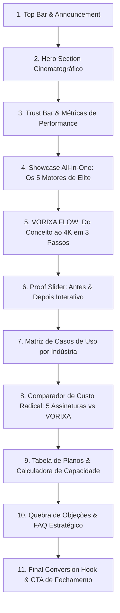
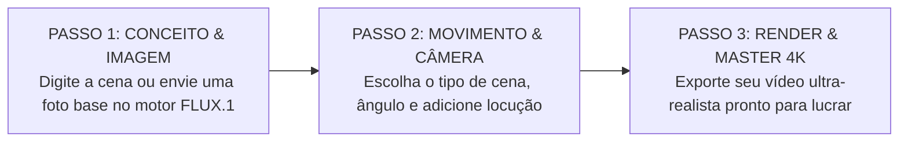

# VORIXA — MASTER COPYWRITING & NARRATIVE ARCHITECTURE (HOME2)
**Documento Oficial de Copywriting de Alta Conversão, Direct Response & Storytelling**  
**Versão:** 2.0.0 (Home2 Production Ready) | **Autor:** @vorixa-copywriter-agent | **Data:** 02/09/2026

---

## 🎯 Visão Estratégica & Posicionamento

* **Grande Ideia (Big Idea):** *"O Fim da Fragmentação de Assinaturas de IA: Seu Estúdio de Cinema e Criadores Virtuais em um Único Lugar, com Controle Determinístico e Sem Roleta-Russa de Prompts."*
* **Inimigo Comum:** Pagar 5 a 6 assinaturas em dólar com IOF (Midjourney, Runway, Kling, ElevenLabs, HeyGen, Topaz), perder horas pulando de aba em aba e continuar recebendo vídeos com movimentos bizarros ou sem sincronia.
* **Mecanismo Único:** **VORIXA Engine Pipeline + VORIXA FLOW™** — O pipeline que conecta a melhor geração de imagem (FLUX.1), animação cinematográfica (Kling 1.5), controle de movimento corporal, sincronia labial realista (LivePortrait LipSync) e upscaling 4K nativo em uma esteira fluida.
* **Tom de Voz:** Autoritário, cinematográfico, transparente, provocador com o desperdício financeiro e obsessivo por ROI e controle criativo.

---

## 🧭 Mapa da Página de Vendas (Home2 Architecture)

---

# 1. BARRA DE TOPO & ANÚNCIO (TOP BANNER)

* **Tag:** `NOVO • VORIXA 2.0`
* **Texto Principal:** *"🚀 Motor Kling 1.5 + LipSync Instantâneo Liberados. Crie seus primeiros vídeos sem gastar nada."*
* **Micro-Link:** `[Experimentar Agora ➔]` *(Leva direto para `/register`)*

---

# 2. SEÇÃO 1: HERO CINEMATOGRÁFICO (PRIMEIRA DOBRA)

> **Objetivo:** Reter o visitante nos primeiros 3 segundos, comunicar a proposta de valor única imediatamente, eliminar o medo de complexidade e gerar o clique no cadastro gratuito.

### 2.1 Badge Superior (Kicker)
`✦ O Estúdio Audiovisual com IA Mais Completo do Brasil`

### 2.2 Headline Principal (H1) — 3 Opções de Alta Conversão

* **Opção 1 (Principal - Foco em Estúdio + Consolidação):**
  > # Seu Estúdio de Cinema e Criadores Virtuais em uma Única Plataforma.
* **Opção 2 (Foco em Dor / Direct Response Agressivo):**
  > # Pare de Pagar 5 Assinaturas em Dólar. Crie Vídeos Cinematográficos e Influenciadores Virtuais com 1 Clique.
* **Opção 3 (Foco em Controle & Qualidade Visual):**
  > # Do Prompt ao Filme em 4K: Direção de Câmera, Lip Sync Perfeito e Controle Absoluto de Movimento.

### 2.3 Subheadline (H2)
> **Esqueça a roleta-russa de prompts e as faturas acumuladas.** Una imagens fotorrealistas em FLUX.1, animações cinematográficas em Kling 1.5, sincronização labial ultra-realista e upscaler 4K. Crie campanhas de alta conversão, UGCs e cenas profissionais em minutos.

### 2.4 Bloco de CTAs Primário & Secundário
* **Botão Primário (Main Action):**
  * **Texto Principal:** `Começar Gratuitamente • Ganhe 100 Créditos`
  * **Ícone:** Raio luminoso (`⚡`)
  * **Efeito:** Glow pulsante Violeta/Indigo (`bg-gradient-to-r from-violet-600 to-indigo-600`)
* **Botão Secundário (Social Proof / Explorar):**
  * **Texto:** `Assistir Demo de 60s` ou `Ver VORIXA FLOW em Ação`
  * **Ícone:** Play em vidro translúcido (`▶`)

### 2.5 Micro-Copy de Alívio de Fricção (Abaixo do CTA)
`✓ Sem necessidade de cartão de crédito  •  ✓ 100 créditos grátis imediatos  •  ✓ Renderização 100% em nuvem (zero peso no seu PC)`

### 2.6 Badges Flutuantes sobre o Player do Hero
* **Tag 1 (Topo Esquerdo):** `● Engine: FLUX.1 Schnell + Kling 1.5 Pro`
* **Tag 2 (Topo Direito):** `⚡ Render Time: 18.4s • 4K UHD`
* **Tag 3 (Base Central):** `🎙️ Lip Sync: 99.8% Sincronia Fonética Ativa`

---

# 3. SEÇÃO 2: BARRA DE PROVA & CONFIANÇA (TRUST BAR)

> **Objetivo:** Transferir autoridade imediata, provar tração e garantir estabilidade técnica de nível corporativo.

### 3.1 Headline de Seção Sutil
`TECNOLOGIA UTILIZADA POR CRIADORES, AGÊNCIAS E MARCAS EM MAIS DE 15 PAÍSES`

### 3.2 Grade de Métricas Reais
| Métrica | Destaque Visual | Significado para o Usuário |
| :--- | :--- | :--- |
| **+150.000** | `Criações Renderizadas` | Plataforma testada em escala massiva |
| **99.8%** | `Fidelidade Labial (Sync)` | Personagens que falam com realismo humano |
| **< 30s** | `Tempo Médio de Geração` | Agilidade para testar dezenas de criativos |
| **100%** | `Direitos Comerciais` | Use em anúncios, clientes e monetização sem royalties |

### 3.3 Logos de Ecossistema & Infraestrutura
`NVIDIA H100 Clusters` • `Black Forest Labs (FLUX)` • `Kling AI Architecture` • `LivePortrait Core` • `Cloudflare Stream`

---

# 4. SEÇÃO 3: SUÍTE ALL-IN-ONE — OS 5 MOTORES DE ELITE

> **Objetivo:** Destruir a necessidade de contratar múltiplas ferramentas. Provar que o VORIXA tem o melhor de cada categoria em uma interface única e harmonizada.

### 4.1 Cabeçalho da Seção
* **Kicker:** `TODAS AS FERRAMENTAS QUE VOCÊ PRECISA`
* **Título:** ## 5 Motores de Inteligência Artificial. Zero Malabarismo de Abas.
* **Subtítulo:** Não escolha entre boa imagem ou bom movimento. No VORIXA, você tem acesso às IAs mais poderosas do planeta integradas em um pipeline contínuo.

---

### 4.2 Os 5 Motores Explicados com Direct Response

#### 1. FLUX.1 Schnell & Dev (Geração de Imagens Hiper-Realistas)
* **Tag:** `FOTORREALISMO EXTREMO`
* **Headline:** Texturas de Pele Reais, Tipografia Perfeita e Iluminação Cinematográfica.
* **Copy:** Adeus dedos deformados e olhos de plástico. Gere retratos hiper-realistas, produtos comerciais e cenários complexos com renderização de iluminação natural (volumetric lighting) e renderização de textos legíveis no primeiro frame.
* **Tag Técnica:** `1024x1024 até 4K • Prompt Adherence 98%`

#### 2. Kling AI 1.5 Motion (Câmera e Dinâmica Física de Cinema)
* **Tag:** `CINEMATIC VIDEO ENGINE`
* **Headline:** Movimentos de Câmera Físicos, Gravidade Real e Fluidez de 60 FPS.
* **Copy:** Dê vida a qualquer imagem estática com controle preciso de trajetória: Pan, Tilt, Zoom, FPV Drone ou Dolly Shot. Simulação precisa de tecidos, fluidos e dinamismo biológico sem distorções no fundo.
* **Tag Técnica:** `5s a 10s contínuos • 1080p nativo • 60 FPS Interpolated`

#### 3. LivePortrait LipSync (Sincronização Labial & Expressão Facial)
* **Tag:** `INFLUENCIADORES & AVATARES VIRTUAIS`
* **Headline:** Faça Qualquer Personagem Falar Qualquer Idioma com Micro-Expressões Humanas.
* **Copy:** Suba um áudio ou gere uma locução em segundos: o motor LivePortrait sincroniza o movimento de lábios, dentes, piscadas e movimentos de cabeça com precisão milimétrica. Crie influenciadores virtuais e UGCs de vendas que parecem 100% reais.
* **Tag Técnica:** `Audio-to-Lip • Suporte a PT-BR natural • Micro-Expressões V2`

#### 4. Motion Control & Transferência de Movimento
* **Tag:** `DIREÇÃO DETERMINÍSTICA`
* **Headline:** Copie a Coreografia, Dança ou Gestual de um Vídeo Real para o seu Personagem.
* **Copy:** Pare de rezar para a IA adivinhar o movimento. Envie um vídeo de referência gravado no celular e faça seu personagem 3D ou modelo realista replicar exatamente os mesmos passos, gestos manuais e postura.
* **Tag Técnica:** `Skeleton Tracking • Pose Alignment • Zero Glitch`

#### 5. Creative Upscaler 4K Ultra-HD
* **Tag:** `MASTERIZAÇÃO FINAL`
* **Headline:** Detalhes de Micro-Texturas e Nitidez Pronta para Telas de Cinema e Outdoors.
* **Copy:** Transforme gerações padrão em peças cristalinas com upscaling generativo inteligente. Recupera fios de cabelo, texturas de tecidos e reflexos nos olhos sem deixar aquele aspecto borrado ou artificial.
* **Tag Técnica:** `Upscale 2x / 4x • Clari-Detail AI • Exportação ProRes / MP4`

---

# 5. SEÇÃO 4: VORIXA FLOW™ — DO CONCEITO AO VÍDEO FINAL EM 3 PASSOS

> **Objetivo:** Quebrar a objeção de que IA generativa profissional é difícil ou requer código. Demonstrar o fluxo de criação intuitivo e fluido.

### 5.1 Cabeçalho da Seção
* **Kicker:** `FLUXO VISUAL INTUITIVO`
* **Título:** ## Da Ideia ao Filme Final em 3 Passos Simples
* **Subtítulo:** Você não precisa de conhecimentos técnicos, prompts quilométricos ou placas de vídeo caras. O VORIXA guia sua criação em uma esteira visual lógica.

### 5.2 Os 3 Passos Estruturados

* **Passo 01 — Digite ou Envie sua Referência:**
  * *Micro-título:* `01. Defina o Visual Base`
  * *Copy:* Digite o que deseja ver ou faça upload de um produto/rosto real. Nosso assistente aprimora seu prompt automaticamente para iluminação de estúdio profissional.
* **Passo 02 — Direcione o Movimento & a Voz:**
  * *Micro-título:* `02. Adicione Vida e Expressão`
  * *Copy:* Escolha a trajetória da câmera (ex: *Zoom Dinâmico*), adicione o arquivo de áudio para o Lip Sync ou aplique transferência de movimento corporal com 1 clique.
* **Passo 03 — Exporte em 4K e Lucre:**
  * *Micro-título:* `03. Masterização Instantânea`
  * *Copy:* Receba seu vídeo renderizado em nuvem em menos de 30 segundos, sem marcas d'água e com direitos comerciais totais para rodar anúncios ou entregar a clientes.

---

# 6. SEÇÃO 5: ANTES & DEPOIS INTERATIVO (PROVA INEGÁVEL)

> **Objetivo:** Permitir ao visitante interagir com o slider e ver a mágica do VORIXA acontecer na frente dos olhos: de uma imagem estática simples a um vídeo cinematográfico vibrante.

### 6.1 Headline da Seção
* **Título:** ## Veja a Transformação em Tempo Real
* **Subtítulo:** Arraste o slider para comparar a imagem estática de entrada e o resultado final animado com física realista e iluminação volumétrica.

### 6.2 Micro-Copy das Abas do Slider
* `Exemplo 1: Influenciadora UGC (Foto Estática ➔ Vídeo Falando com Lip Sync Perfeito)`
* `Exemplo 2: E-commerce de Produto (Render 2D ➔ Comercial 3D com Rotação de Câmera)`
* `Exemplo 3: Cena Cinematográfica (Arte Conceitual ➔ Sequência com Chuva e Movimento FPV)`

---

# 7. SEÇÃO 6: CASOS DE USO POR INDÚSTRIA & NICHO

> **Objetivo:** Fazer o visitante se enxergar imediatamente obtendo ROI massivo com a ferramenta, independentemente do seu modelo de negócio.

### 7.1 Cabeçalho
* **Kicker:** `APLICAÇÃO NO MUNDO REAL`
* **Título:** ## Feito Sob Medida para Quem Precisa de Resultados Rápidos
* **Subtítulo:** Não é apenas arte conceitual: é uma máquina de tração, vendas e economia operacional para o seu ecossistema.

---

### 7.2 Os 4 Pilares de Casos de Uso

#### 1. E-commerce, Dropshipping & D2C Brands
* **Dores Resolvidas:** Acabe com o custo de estúdios fotográficos, contratação de modelos, envio de amostras e semanas de espera para lançar uma coleção.
* **Como o VORIXA resolve:** Crie fotos de produtos em cenários de luxo e transforme imagens em vídeos verticais (9:16) no estilo TikTok/Reels mostrando o produto em ação com modelos virtuais de qualquer etnia.
* **Resultado Chave:** `+340% de CTR em criativos de Meta Ads e TikTok Ads.`

#### 2. Agências de Tráfego Pago & Performance
* **Dores Resolvidas:** Fadiga de criativos no Facebook Ads, altos custos de produção de variações e incapacidade de testar 20 criativos novos por semana.
* **Como o VORIXA resolve:** Produza dezenas de ganchos (hooks) diferentes para o mesmo produto em minutos, trocando o rosto do avatar, a voz e o cenário com poucos cliques.
* **Resultado Chave:** `Escala de ROAS com custo de produção reduzido a centavos por variação.`

#### 3. Criadores de Conteúdo, Afiliados & Canais Dark
* **Dores Resolvidas:** Timidez de aparecer na câmera, custo de microfone/iluminação e falta de consistência na produção diária de vídeos para YouTube e TikTok.
* **Como o VORIXA resolve:** Crie personagens consistentes que narram histórias, ensinam tutoriais e promovem produtos como afiliados sem você precisar gravar um único segundo do seu próprio rosto.
* **Resultado Chave:** `Canais monetizados e consistência de postagem 10x mais rápida.`

#### 4. Produtoras Audiovisuais, Cineastas & Designers
* **Dores Resolvidas:** Tempo excessivo gasto em storyboards 3D manuais, renders demorados em After Effects e limitações de orçamento de clientes.
* **Como o VORIXA resolve:** Pitching de projetos com concept arts foto-realistas, cenas b-roll cinematográficas e pré-visualizações completas em 4K para aprovação imediata do cliente.
* **Resultado Chave:** `Aprovação de orçamentos 5x mais rápida com demonstrações visuais impactantes.`

---

# 8. SEÇÃO 7: COMPARATIVO DE CUSTO RADICAL (A MATEMÁTICA DO ROI)

> **Objetivo:** Tornar a decisão irracionalmente óbvia pelo lado financeiro. Mostrar o desperdício brutal de assinar ferramentas isoladas em dólar versus o VORIXA All-in-One.

### 8.1 Cabeçalho
* **Kicker:** `A CONTA QUE NINGUÉM TE MOSTRA`
* **Título:** ## Pare de Queimar Dinheiro com 5 Assinaturas em Dólar
* **Subtítulo:** Veja quanto você gasta todos os meses somando plataformas isoladas (com IOF e conversão de moeda) vs. assinar o ecossistema completo do VORIXA.

---

### 8.2 Tabela de Comparação Financeira

| Ferramenta Isolada | Função Principal | Custo Médio Mensal (com IOF) |
| :--- | :--- | :--- |
| **Midjourney / DALL-E 3** | Geração de Imagem Estática | ~R$ 180,00 / mês ($30 USD) |
| **Runway Gen-3 / Luma** | Geração de Vídeo e Movimento | ~R$ 350,00 / mês ($60 USD) |
| **ElevenLabs / Voiser** | Vozes Neurais e Áudio | ~R$ 140,00 / mês ($22 USD) |
| **HeyGen / D-ID** | Lip Sync & Animação Facial | ~R$ 290,00 / mês ($49 USD) |
| **Topaz Video AI / Upscaler** | Upscaling e Nitidez 4K | ~R$ 150,00 / mês ($25 USD) |
| **TOTAL SEPARADO POR MÊS:** | *5 Plataformas Desconectadas* | **R$ 1.110,00 / mês** |
| 🚀 **VORIXA ALL-IN-ONE:** | **Todos os 5 Motores Integrados** | **A partir de R$ 49,00 / mês** |

### 8.3 Chamada de Destaque Financeiro (Callout Box)
> ### 💡 Economia Real de +R$ 1.000,00 Todos os Meses
> Com o VORIXA, você economiza mais de **R$ 12.000 por ano**, elimina a dor de cabeça de faturas internacionais no cartão e ganha velocidade criando tudo em uma única linha do tempo fluida.
> 
> `[Quero Economizar Agora e Ter Todas as Ferramentas ➔]`

---

# 9. SEÇÃO 8: TABELA DE PLANOS & CALCULADORA DE CAPACIDADE

> **Objetivo:** Deixar claro exatamente o que o usuário recebe em cada nível de investimento. Eliminar a ansiedade de "quantos vídeos isso rende na prática".

### 9.1 Cabeçalho
* **Kicker:** `PLANOS TRANSPARENTES E SEM SURPRESAS`
* **Título:** ## Escolha a Escala Ideal para o Seu Negócio
* **Subtítulo:** Pague em reais via Pix ou Cartão nacional. Cancele quando quiser com 1 clique.

### 9.2 Toggle de Cobrança
`[ Mensal ]  |  [ Anual (Economize 20% + Bônus de Créditos) ✨ ]`

---

### 9.3 Tiers de Planos Detalhados

#### PLANO 1: STARTER (Para Criadores e Iniciantes)
* **Badge:** `COMEÇO RÁPIDO`
* **Preço:** **R$ 49** / mês *(ou R$ 39/mês no plano anual)*
* **Créditos:** **300 Créditos / mês**
* **O que você produz com este plano:**
  * ~60 Imagens Hiper-Realistas em FLUX.1
  * ~15 Vídeos Cinematográficos em Kling 1.5
  * ~10 Sincronizações Labiais completas (Lip Sync)
  * Renderização em Alta Resolução (1080p)
  * Suporte prioritário via ticket em Português
  * 100% Direitos de Uso Comercial
* **CTA:** `[Começar com Starter]`

#### PLANO 2: PRO CREATOR (O Mais Escolhido 🔥)
* **Badge:** `MAIS POPULAR • MELHOR CUSTO-BENEFÍCIO`
* **Preço:** **R$ 119** / mês *(ou R$ 95/mês no plano anual)*
* **Créditos:** **1.000 Créditos / mês**
* **O que você produz com este plano:**
  * ~250 Imagens Hiper-Realistas em FLUX.1
  * ~50 Vídeos Cinematográficos em Kling 1.5
  * ~35 Sincronizações Labiais completas com Expressão Facial
  * Upscaling 4K Ultra-HD Ilimitado
  * Fila de Processamento Prioritário em GPU Turbo
  * Acesso antecipado aos novos modelos e recursos
  * 100% Direitos de Uso Comercial e Sem Marcas d'Água
* **CTA:** `[Garantir Acesso Pro Creator]`

#### PLANO 3: STUDIO & AGENCY (Para Agências e Produtoras)
* **Badge:** `ALTA PERFORMANCE & ESCALA`
* **Preço:** **R$ 249** / mês *(ou R$ 199/mês no plano anual)*
* **Créditos:** **3.000 Créditos / mês**
* **O que você produz com este plano:**
  * ~800 Imagens em FLUX.1
  * ~160 Vídeos Cinematográficos em Kling 1.5
  * ~120 Sincronizações Labiais para UGCs e Campanhas
  * Processamento Simultâneo (Gere múltiplos vídeos ao mesmo tempo)
  * Fila Ultra-Priority em clusters dedicados NVIDIA H100
  * Suporte VIP via WhatsApp com especialista em IA
  * Múltiplos formatos de exportação (9:16, 16:9, 1:1, 4:5)
* **CTA:** `[Contratar Plano Studio]`

---

# 10. SEÇÃO 9: QUEBRA DE OBJEÇÕES & FAQ ESTRATÉGICO

> **Objetivo:** Eliminar qualquer dúvida jurídica, técnica ou operacional que impeça o cadastro e o upgrade imediato.

### 1. Posso usar as imagens e vídeos gerados para fins comerciais e anúncios?
**Resposta:** **Sim, 100%.** Todo conteúdo renderizado no VORIXA pertence a você. Você tem direitos irrestritos para veicular em campanhas de tráfego pago (Meta Ads, TikTok Ads, Google), vender criativos para clientes, publicar em canais monetizados do YouTube ou aplicar em lojas virtuais sem qualquer royalty adicional.

### 2. Os vídeos vêm com alguma marca d'água da VORIXA?
**Resposta:** **Não.** Todas as renderizações são entregues com acabamento profissional limpo, em alta definição e sem nenhum tipo de logotipo ou marca d'água da plataforma.

### 3. Preciso de um computador potente ou placa de vídeo dedicada?
**Resposta:** **Não precisa.** 100% do processamento pesado de Inteligência Artificial é executado em nossos servidores em nuvem equipados com as GPUs mais potentes do mercado (NVIDIA H100/A100). Você pode criar vídeos cinematográficos diretamente do seu navegador, notebook comum ou até pelo celular.

### 4. O que acontece se meus créditos do mês acabarem?
**Resposta:** Seus projetos e arquivos permanecem salvos em segurança na sua conta. Você pode recarregar pacotes avulsos de créditos a qualquer momento com desconto ou fazer upgrade de plano com 1 clique, sem perder seu progresso.

### 5. Como funciona a política de cancelamento?
**Resposta:** **Zero burocracia.** Você pode cancelar sua assinatura diretamente no painel do usuário a qualquer momento com apenas um clique. Sem multas, sem contratos de fidelidade forçados e sem precisar falar com atendentes.

### 6. Como funciona o suporte e o atendimento?
**Resposta:** Todo o nosso suporte é prestado **100% em português** por uma equipe de especialistas em IA e criação audiovisual, com atendimento rápido via chat, tickets e suporte VIP via WhatsApp para planos Studio.

---

# 11. SEÇÃO 10: CTA FINAL DE FECHAMENTO (THE CONVERSION HOOK)

> **Objetivo:** O empurrão final. Criar urgência com os 100 créditos de boas-vindas e reforçar a facilidade de começar hoje mesmo.

### 11.1 Estrutura do Card de Fechamento Imersivo
* **Efeito Visual:** Aurora Glow em tons Violeta e Índigo com partículas sutis de luz.
* **Kicker:** `PRONTO PARA REVOLUCIONAR SUA PRODUÇÃO AUDIOVISUAL?`
* **Headline:** 
  > ## Crie Seu Primeiro Vídeo Cinematográfico nos Próximos 2 Minutos.
* **Subheadline:** 
  > Junte-se a milhares de criadores, agências e marcas que já abandonaram a roleta-russa de prompts e economizam milhares de reais todos os meses.
* **CTA Principal:**
  * **Texto:** `Criar Conta Gratuita e Resgatar 100 Créditos ⚡`
  * **Micro-texto de Confiança:** `Leva menos de 30 segundos • Sem cartão de crédito • Acesso imediato a todos os motores`

---

# 12. GUIA DE IMPLEMENTAÇÃO PARA O TIME DE DESIGN & FRONTEND

### 12.1 Mapeamento de Cores e Tokens de Copy
* **Acentos de Ênfase:** `text-transparent bg-clip-text bg-gradient-to-r from-violet-400 via-purple-300 to-indigo-300`
* **Badges Flutuantes:** `bg-black/60 backdrop-blur-md border border-white/10 text-slate-200 text-xs font-mono`
* **Preços & Destaques:** `text-emerald-400` para percentual de economia e `text-violet-400` para bônus de créditos.

### 12.2 Diretriz de Micro-Copy Dinâmico
* Quando o usuário alternar o toggle de preço para **Anual**, exibir badge verde animado: `[ ECONOMIZE 20% + 2 MESES GRÁTIS ]`.
* No hover dos botões de CTA, ativar micro-efeito de expansão sutil (`scale-[1.02]`) com sombra violeta difusa.

---
*Fim do documento de Copywriting Master (Home2). Homologado para produção.*
