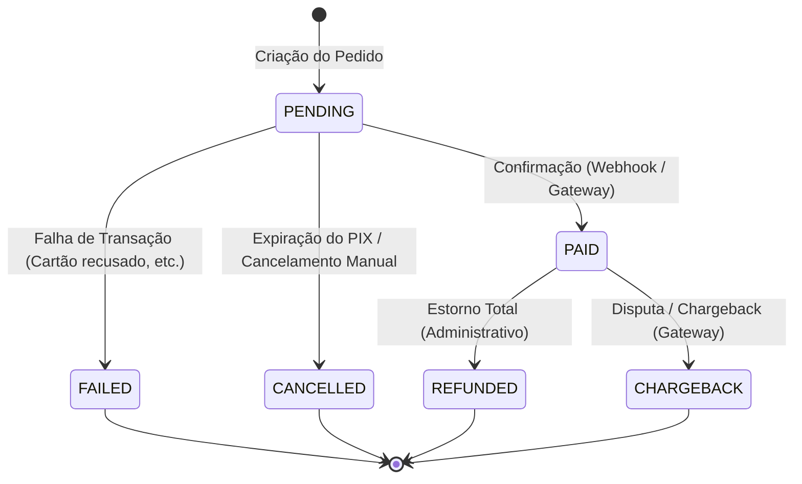

# VORIXA - Arquitetura Financeira e Máquina de Estados (Fase 6.1)

Este documento especifica a infraestrutura financeira, entidades conceituais e a máquina de estados rígida para o ciclo de faturamento, pagamentos e concessão de créditos do VORIXA.

---

## 1. Entidades Conceituais Financeiras

| Entidade | Descrição | Regras de Negócio |
|---|---|---|
| **User** | Conta do cliente final que consome e adquire créditos. | Deve possuir associação com um único `CreditBalance`. |
| **Package / Product** | Pacotes de créditos disponíveis para compra no catálogo. | Contém quantidade de créditos, preço final em centavos (BRL), status (ativo/inativo), e custo estimado do provedor de IA. |
| **Order (Pedido)** | Registro de intenção de compra de um pacote por um usuário. | Relação de 1-para-1 com o pacote adquirido no momento da criação. O valor e os créditos são congelados na criação. |
| **Payment (Pagamento)** | Transação gerada no gateway (ex: VorexPay) atrelada a um pedido. | Possui identificador único do provedor de pagamento, link de checkout (PIX/Cartão) e status na máquina de estados. |
| **Ledger / CreditTransaction** | Histórico imutável de movimentações de saldo de créditos do usuário. | Toda concessão por pagamento aprovado ou débito por geração de IA gera uma linha imutável. Proibido deletes. |
| **AuditLog** | Registros de auditoria para ações financeiras manuais/críticas. | Registra alterações administrativas de saldo feitas por administradores (`role === 'ADMIN'`). |

---

## 2. Máquina de Estados de Pagamentos

Para garantir a consistência e integridade financeira, os pagamentos seguem uma máquina de estados com transições estritamente unidirecionais. Regressões de estado (ex: de `PAID` de volta para `PENDING`) são ativamente bloqueadas.

### Matriz de Transição de Estados

| Estado Atual | Próximo Estado Permitido | Concessão de Crédito? | Estorno/Débito de Crédito? | Justificativa / Comportamento |
|---|---|---|---|---|
| **PENDING** | `PAID`, `FAILED`, `CANCELLED` | Não | Não | Estado inicial de faturamento aguardando compensação. |
| **PAID** | `REFUNDED`, `CHARGEBACK` | **Sim** (Executado no momento da transação) | Não | Pagamento confirmado. Dispara o crédito de tokens no saldo do usuário. |
| **FAILED** | Nenhum (Estado Final) | Não | Não | Transação mal-sucedida. Permite que o usuário tente novamente gerando outro pedido. |
| **CANCELLED** | Nenhum (Estado Final) | Não | Não | O link de pagamento expirou ou o usuário cancelou o pedido. |
| **REFUNDED** | Nenhum (Estado Final) | Não | **Sim** (Estorno dos créditos) | Estorno manual ou administrativo. Debita os tokens equivalentes do saldo do usuário. |
| **CHARGEBACK** | Nenhum (Estado Final) | Não | **Sim** (Bloqueio/Débito) | Contestação de compra via cartão de crédito. Debita tokens e sinaliza antifraude. |

---

## 3. Regras de Segurança e Idempotência (Borda & Server)

1. **Zero-Trust Frontend**: O frontend nunca envia informações sobre créditos a serem liberados ou status de pagamento. A rota de webhook ou o serviço do gateway consulta as informações diretamente no banco baseando-se no `paymentId` de confiança.
2. **Idempotência de Webhook**: Cada notificação recebida do gateway de pagamento deve possuir uma chave de idempotência (ex: hash da transação ou `paymentId` + status). O reprocessamento de webhooks duplicados deve responder `HTTP 200 OK` de forma imediata sem re-executar a concessão de créditos no banco.
3. **Isolamento de userId**: A sessão segura do usuário (`session.user.id`) obtida no backend é a única credencial aceita para vincular o pedido ao usuário. É proibido passar `userId` customizado no corpo da requisição de checkout.
4. **Proteção Transacional**: A transição de estados de pagamento que resulte em concessão (`PAID`) ou débito por estorno (`REFUNDED`) deve ser executada dentro de um bloco transacional (`prisma.$transaction`) contendo locks pessimistas ou verificação de versão para evitar race conditions.

---

## 4. Pendências de Integração Financeira

As seguintes dependências externas e testes de sandbox serão documentados de forma cumulativa em `docs/PENDING_TESTS.md`:
* Homologação de Webhooks seguros com assinatura HMAC do gateway de pagamento em ambiente de staging/produção.
* Fluxo end-to-end de simulação de PIX e Cartão em ambiente sandbox do provedor.
* Teste de concorrência com disparos simultâneos de webhooks para o mesmo `paymentId`.
