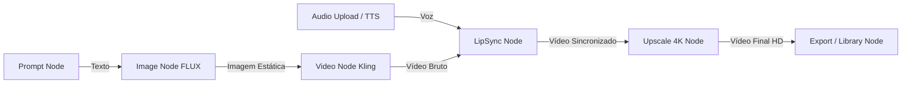

# Especificação Técnica e de Produto — Fase 8: VORIXA Creative Workspace & Flow

## 1. Visão do Produto
O **VORIXA** evolui de um catálogo de ferramentas isoladas de IA para um **AI Creative Workspace** integrado e cinematográfico. O diferencial central é o **VORIXA FLOW**, um canvas visual de criação baseado em grafos (DAG), permitindo encadear modelos generativos (Texto -> Imagem FLUX -> Vídeo Kling/Luma -> LipSync -> Upscale 4K) com controle total de parâmetros, preview em tempo real e execução granular.

---

## 2. Direção Visual & Design System V2

### 2.1. Princípios de Design
* **Dark, Futuristic & Cinematic**: Fundo Obsidian profundo (`#070709`), superfícies de nós e painéis em ardósia técnica (`#0D0E12`, `#13141B`) e bordas ativas sutis (`#1E202E`).
* **Tipografia de Alta Precisão**: `Outfit` para títulos e headlines de impacto, `Inter` para clareza e densidade de controles, e `Geist Mono / JetBrains Mono` para timecodes, resoluções, IDs e créditos.
* **Handles e Conexões com Tipagem Visual**:
  * **Texto/Prompt**: Roxo Violeta (`#8B5CF6`)
  * **Imagem**: Ciano Elétrico (`#06B6D4`)
  * **Vídeo**: Esmeralda Cinemático (`#10B981`)
  * **Áudio**: Âmbar Vibrante (`#F59E0B`)
  * **Motion**: Rosa Neon (`#EC4899`)

---

## 3. Arquitetura do VORIXA Flow (Frontend)

### 3.1. Canvas e Componentes
* **Engine**: `@xyflow/react` (React Flow v12) com virtualização (`onlyRenderVisibleElements`), memoização estrita em nós customizados (`React.memo`) e gerenciamento de estado via Zustand.
* **Custom Nodes Ricos**:
  * Header com ícone, status (`IDLE`, `QUEUED`, `PROCESSING`, `READY`, `ERROR`), menu contextual e custo unitário de créditos.
  * Handles de entrada e saída com validação estrita de tipos de dados (impede conexões inválidas, ex: áudio em entrada de imagem).
  * Preview interativo embutido (thumbnails, players de vídeo em loop leve sob demanda).
* **Painel Lateral de Propriedades (Inspector Drawer)**: Edição de parâmetros avançados de inferência (seeds, steps, CFG scale, resoluções).
* **AI Flow Builder ("✦ Build with AI")**: Comando rápido (`Cmd+K` / `Ctrl+K`) que converte descrições em linguagem natural em topologias completas de nós no canvas.

---

## 4. Engenharia de Backend e Banco de Dados (Prisma)

### 4.1. Modelos Propostos no `schema.prisma`
* `Flow`: Grafo do usuário (`userId`, `name`, `viewport`, `status: DRAFT | ACTIVE | ARCHIVED`).
* `FlowNode`: Nós do canvas (`flowId`, `nodeType`, `toolSlug`, `title`, `positionX`, `positionY`, `config`).
* `FlowConnection`: Arestas com tipagem de handles (`flowId`, `sourceNodeId`, `sourceHandle`, `targetNodeId`, `targetHandle`).
* `FlowExecution`: Registro macro de execução (`flowId`, `userId`, `status: PENDING | RUNNING | COMPLETED | FAILED`, `totalCreditCost`, `idempotencyKey`).
* `FlowNodeExecution`: Execução granular de cada nó vinculado ao `AIJob` real correspondente (`resolvedInputs`, `outputs`, `creditCost`, `status`).

### 4.2. Algoritmo de Grafo e Resiliência Financeira
1. **Validação de DAG (Kahn's Algorithm)**: Detecção e bloqueio de loops infinitos ($A \to B \to A$) com retorno HTTP 400 (`CYCLE_DETECTED`).
2. **Cálculo Prévio & Reserva com Lock**: Validação de saldo (`SELECT FOR UPDATE`) para a soma total estimada do fluxo.
3. **Débito e Estorno Atômico Granular**:
   * Nós são executados sequencialmente ou em paralelo conforme dependências resolvidas.
   * Se o Nó 2 falhar em um pipeline de 4 nós: Nó 1 faturado e entregue, Nó 2 estornado no Ledger (`GENERATION_REFUND`), Nós 3 e 4 cancelados (`SKIPPED`) e jamais cobrados.

---

## 5. Matriz de Segurança, Tenancy & Anti-IDOR

1. **Escopo Obrigatório por Tenant**: Toda query e mutação valida `where: { id: flowId, userId: session.user.id }`.
2. **Prevenção a Cross-Tenant Injection**: Verificação recursiva de que todos os nós e conexões submetidos pertencem exclusivamente ao `flowId` autorizado do usuário.
3. **Zero Trust em Custos**: O servidor ignora qualquer campo de créditos vindo do cliente e recalcula diretamente das tabelas `AITool` / `AIModel`.
4. **Proteção SSRF**: Validação rigorosa de URLs de entrada para nós de mídia contra IPs privados, loopback e esquemas inseguros.

---

## 6. Mapeamento de Telas do Produto

1. **Landing Page (`app/page.tsx`)**: Hero cinematográfico com demonstração interativa do Flow, vitrine de mídias geradas por IA, comparativos e tabela de planos/créditos.
2. **Studio Unificado CREATE (`app/dashboard/create/page.tsx`)**: Interface moderna de geração individual reaproveitando as 5 ferramentas existentes.
3. **Canvas do VORIXA FLOW (`app/dashboard/flow/[id]/page.tsx` & `/dashboard/flow/page.tsx`)**: Workspace infinito, templates pré-configurados, biblioteca de nós e botão "✦ Build with AI".
4. **Library (`app/dashboard/library/page.tsx`)**: Gestão centralizada de Flows salvos, mídias geradas com lightbox e uploads de assets de entrada.

---

## 7. Roadmap de Implementação da Fase 8

* **Etapa 2 (Aprovação)**: Validação desta especificação técnica e do plano de execução.
* **Etapa 3 (Arquitetura de Dados & Prisma)**: Criação das entidades no `schema.prisma`, geração e aplicação de migration reproduzível no PostgreSQL.
* **Etapa 4 (Backend Services & APIs)**: Implementação de `FlowService`, `FlowExecutionService` (validador de DAG, orquestrador de jobs), controllers `/api/flows/*` e extensão do webhook fal.ai.
* **Etapa 5 (Frontend Core & Flow Canvas)**: Instalação de `@xyflow/react`, criação dos Custom Nodes, Custom Edges, Toolbar, Inspector e Store Zustand.
* **Etapa 6 (Frontend Módulos)**: Implementação das páginas `/create`, `/library`, `/flow` e nova `Landing Page` cinematográfica.
* **Etapa 7 (Auditoria Adversarial & Testes)**: Criação de `__tests__/flow.test.ts` validando IDOR, concorrência, loops cíclicos e estornos parciais no PostgreSQL real via Prisma.
* **Etapa 8 (Validação de Build)**: Execução de `npm run test` e `npm run build` (Turbopack).
* **Etapa 9 (Documentação Cumulativa)**: Atualização de `docs/MANUAL_DEV.md`, `docs/MANUAL_USER.md`, `docs/CHANGELOG.md` e `documents/task.md`.
* **Etapa 10 (Homologação Final)**: Revisão cruzada pelos 3 subagents.

---

## 8. Revisão Arquitetural Complementar & Compatibilidade Real

### 8.1. Auditoria dos 15 Itens da Implementação Real Existente

| Item | Componente | Classificação | Diagnóstico de Compatibilidade |
| :---: | :--- | :---: | :--- |
| 1 | `AIJob` atual | **REUTILIZÁVEL / PRECISA DE EXTENSÃO** | Permanece como a unidade atômica de inferência com provedores externos (fal.ai); associado via relação 1:1 com `FlowNodeExecution.aiJobId`. |
| 2 | `AITool` / `AIModel` | **REUTILIZÁVEL** | Fonte única de verdade de custos, parâmetros e status de ativação das ferramentas. |
| 3 | Serviços de geração (`AIService`, providers) | **REUTILIZÁVEL / PRECISA DE EXTENSÃO** | Desacoplamento para permitir despacho de nós individuais pelo orquestrador do DAG. |
| 4 | `CreditBalance` | **EXISTENTE / REUTILIZÁVEL** | Mantido com lock pessimista (`SELECT FOR UPDATE`) para todas as mutações e reservas de saldo de flows. |
| 5 | `CreditTransaction` | **REUTILIZÁVEL / PRECISA DE EXTENSÃO** | Ledger imutável estendido para registrar débitos de reserva e estornos parciais com idempotência. |
| 6 | Ledger Global | **EXISTENTE / REUTILIZÁVEL** | Princípio de dupla entrada contábil e auditoria estrita preservado. |
| 7 | Webhook dos Providers (`/api/webhooks/fal`) | **PRECISA DE EXTENSÃO** | Estendido para notificar `FlowExecutionService` e acionar transições de nós dependentes no DAG. |
| 8 | Sistema de Créditos (`CreditService`) | **REUTILIZÁVEL / PRECISA DE EXTENSÃO** | Inclusão de métodos dedicados para reserva e liquidação granular de pipelines. |
| 9 | Idempotência Existente | **REUTILIZÁVEL / PRECISA DE EXTENSÃO** | Constraints únicas aplicadas em `FlowExecution.idempotencyKey` e chaves derivadas de nós. |
| 10 | Autenticação (`auth()`, NextAuth) | **EXISTENTE / REUTILIZÁVEL** | Sessão segura do servidor utilizada como única fonte de identidade. |
| 11 | Ownership & Anti-IDOR | **EXISTENTE / REUTILIZÁVEL** | Escopo `where: { id: flowId, userId: session.user.id }` mandatório em todas as queries. |
| 12 | Armazenamento de Outputs (`StorageService`) | **REUTILIZÁVEL / PRECISA DE EXTENSÃO** | Validação SSRF (`isTrustedHost`) e propagação segura de saídas upstream para entradas downstream. |
| 13 | Estados dos Jobs (`JobStatus`) | **REUTILIZÁVEL / PRECISA DE NOVA ESTRUTURA** | Criação dos novos enums `FlowExecutionStatus` e `FlowNodeExecutionStatus`. |
| 14 | Tratamento de Erros | **REUTILIZÁVEL / PRECISA DE EXTENSÃO** | Propagação de falha em grafo, cancelando descendentes e preservando nós já concluídos. |
| 15 | Arquitetura de Filas | **PRECISA DE NOVA ESTRUTURA / RISCO CONTROLADO** | Máquina de estados orientada a eventos via Webhook + Polling Fallback de liveness. |

### 8.2. Resoluções Técnicas das 13 Questões Críticas de Engenharia

* **A. `FlowNodeExecution` separado de `AIJob`**: Sim, desacoplado obrigatoriamente. Permite nós não-generativos (Prompt, Upload, Exporter) e histórico de retries individuais sem poluir a tabela de inferência.
* **B. Relação `FlowExecution` com `AIJob`**: Indireta e hierárquica: `FlowExecution (1) -> FlowNodeExecution (N) -> AIJob (0..1)`.
* **C. Representação de Inputs/Outputs**: `FlowNode.config` (JSON fixo) mesclado deterministicamente com `FlowNodeExecution.outputs` do nó pai através das arestas `FlowConnection`.
* **D. Preservação de Ownership**: `userId` injetado exclusivamente via sessão do servidor; validação aninhada impedindo injeção de nós de outros usuários no mesmo grafo.
* **E. Cálculo de Custo Zero Trust**: Backend soma os custos unitários das ferramentas (`AITool.model.creditCost`) cadastradas no banco; valores do cliente são descartados.
* **F. Débito e Refund Parcial Atômico**: Reserva inicial com lock pessimista (`SELECT FOR UPDATE`); liquidação nó a nó; estorno imediato no Ledger do saldo restante ($\text{creditsReserved} - \text{creditsCharged}$) com chave única de estorno.
* **G. Jobs Assíncronos & Webhooks**: Webhook processa o nó em transação serializada no `FlowExecution`, resolve dependências e despacha a próxima camada do DAG; polling de liveness atua como contingência.
* **H. Cancelamento de Nós Dependentes**: Travessia BFS a partir do nó com falha, marcando descendentes como `SKIPPED` ou `CANCELLED` e liberando estorno.
* **I. Idempotência**: `idempotencyKey` única no `FlowExecution` (rejeitando parâmetros divergentes com HTTP 409) e chaves derivadas por nó `${flowExecId}_${nodeId}_${attempt}`.
* **J. Prevenção de Duplo Disparo**: Lock pessimista na inicialização e na transição de estados dos webhooks paralelos.
* **K. Retry Granular vs Flow**: Suporte a retry de nós individuais (reaproveitando outputs upstream já concluídos) ou reexecução completa do flow em novo ID contábil.
* **L. Representação de Falha Parcial**: Status `PARTIALLY_FAILED` em `FlowExecutionStatus`, preservando mídias geradas pelos nós bem-sucedidos na Library.
* **M. Consistência com o Ledger**: Invariante $\text{creditsReserved} = \text{creditsCharged} + \text{creditsRefunded}$; auditoria automatizada via `ReconciliationService`.

---

## 9. Homologação da Fase 5.1 (Revisão Visual, UX, Produto e Segurança)

### 9.1. Parecer Multidisciplinar dos Três Subagentes
1. **Frontend & UX (`@vorixa-frontend-agent`)**:
   * Aprovada a identidade Dark Obsidian (`#070709`, `#0D0E12`, `#13141B`, bordas `#1E202E`).
   * Hierarquia orientada a produto criativo (*AI Creative Workspace*): `CREATE` -> `BUILD` -> `RUN` -> `RESULT`.
   * Nós com feedback visual de execução em tempo real (`QUEUED`, `RUNNING`, `COMPLETED`, `FAILED`).
   * Suporte a acessibilidade com `prefers-reduced-motion` e animação `@keyframes flowDash` em conexões ativas.
   * Drawer lateral adaptativo no mobile para o Node Inspector e controles touch-friendly.
2. **Backend & Resiliência (`@vorixa-backend-agent`)**:
   * Zero Trust rigoroso com autoridade 100% no servidor para custos, saldos e inferência.
   * Lock pessimista (`SELECT FOR UPDATE`) para reservas e estornos atômicos.
   * Algoritmo de Kahn com detecção determinística de ciclos (`CYCLE_DETECTED`).
   * Cumprimento da invariante $\text{creditsReserved} = \text{creditsCharged} + \text{creditsRefunded}$ em execuções normais, falhas parciais e cancelamentos.
3. **Segurança & QA Adversarial (`@vorixa-security-qa-agent`)**:
   * Blindagem total contra IDOR em Flows, Nodes, Connections e Executions.
   * Imunidade comprovada a injeções de nós cross-tenant e mass assignment.
   * Proteção XSS em prompts e configurações JSON com escape nativo no React/JSX.
   * Validação anti-XSS no `MediaLightbox` com regex de esquema seguro (`https://`, `/`, `blob:`).

